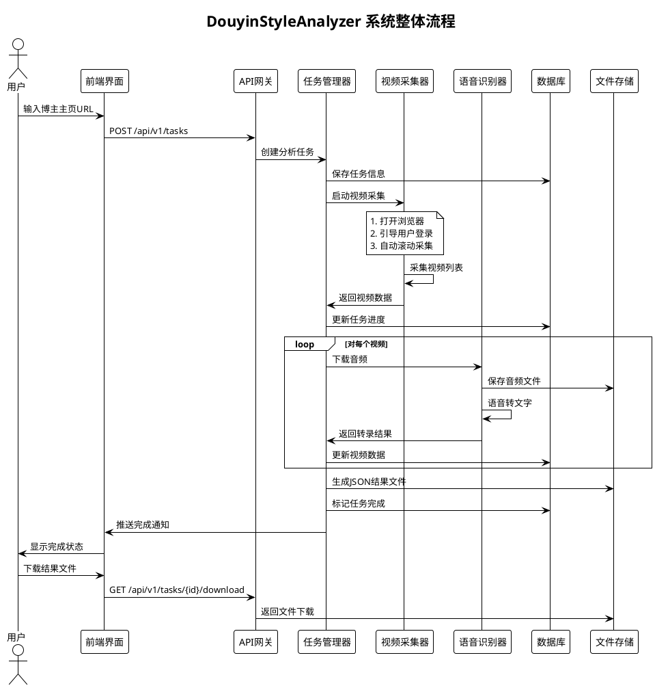
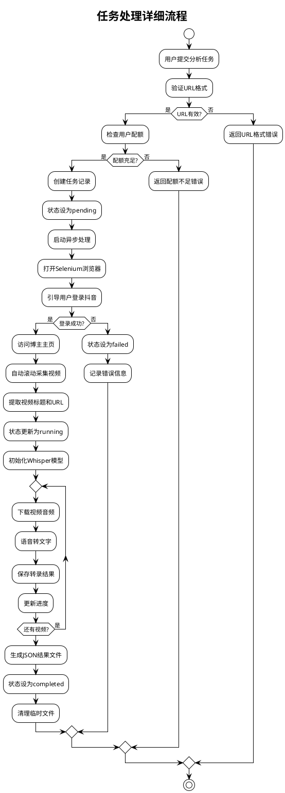
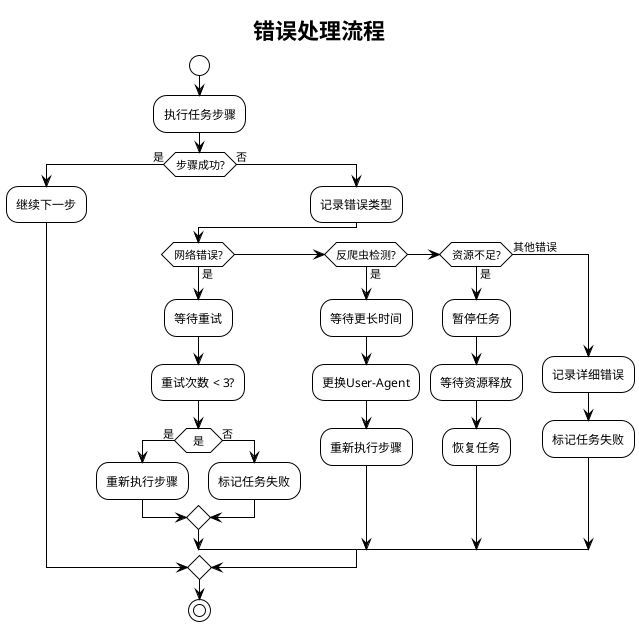
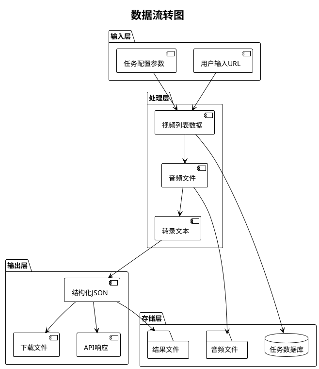
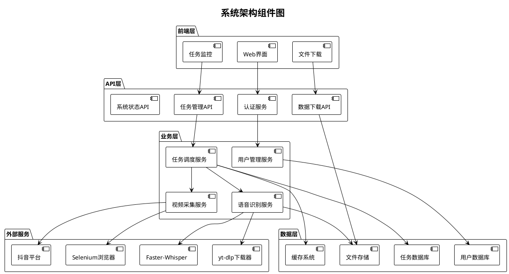
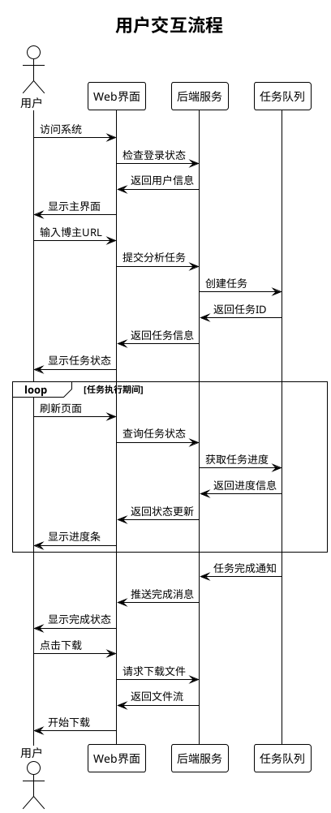

# 流程图设计文档

## 5.1 系统整体流程图



## 5.2 任务处理详细流程图



## 5.3 错误处理流程图



## 5.4 数据流转图



## 5.5 系统架构组件图



## 5.6 用户交互流程图



## 5.7 系统监控流程图

```plantuml
@startuml
!theme plain
title 系统监控流程

participant "监控服务" as Monitor
participant "任务管理器" as TaskManager
participant "资源监控" as ResourceMonitor
participant "告警系统" as Alert

Monitor -> TaskManager: 查询任务状态
TaskManager -> Monitor: 返回任务信息
Monitor -> ResourceMonitor: 查询系统资源
ResourceMonitor -> Monitor: 返回资源使用情况

if (资源使用率 > 80%?) then (是)
    Monitor -> Alert: 发送资源告警
    Alert -> Monitor: 确认告警
else (否)
    :继续监控;
endif

if (任务失败率 > 10%?) then (是)
    Monitor -> Alert: 发送任务告警
    Alert -> Monitor: 确认告警
else (否)
    :继续监控;
endif

if (系统响应时间 > 5s?) then (是)
    Monitor -> Alert: 发送性能告警
    Alert -> Monitor: 确认告警
else (否)
    :继续监控;
endif

Monitor -> Monitor: 记录监控数据
Monitor -> Monitor: 生成监控报告

@enduml
```
